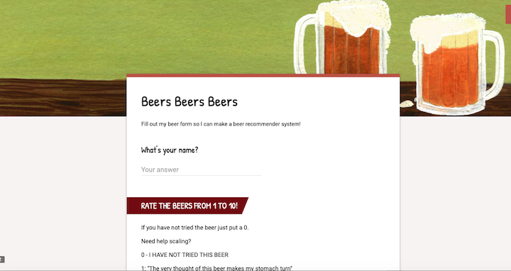

Title: OxyBeerOn: A Beer Recommender App
Date: 2019-06-04 10:20
Tags: python
Slug: blog_5

Last week, I finished my Data Science boot camp at Bitmaker General Assembly in Toronto. For the final two weeks, I spent my time working on my final project, known as the Capstone Project. This blog will be an overview of this project, from its inception to my presentation last Thursday. For the project, I decided to make a beer recommender system. There were various reasons as to why I chose this project. First, I've been bartending for the last three years, and I've become fairly knowledgeable about beer, and have become a human recommender system in the process. Most customers are not very well-informed about the different styles of beers, and a recommender system could help people to figure out which beers they would most prefer. Second, we only spent a couple hours during the 12-week course on recommender systems, so I thought it would be a challenge to dig deeper into the area. Third, it became quite obvious when I was researching the various project ideas I had, that it was almost impossible to find examples of recommender systems online, that were not based on the MovieLens dataset. This sealed the deal for me, knowing that I would have to wrangle my own data and model without the benefit of a bevy of online examples. 

# Step One: Web Scraping

The first thing I needed to do was find my beer data. The first place I found was the website Brewery DB. Brewery DB is an online database, developed for brewers and web developers to power their apps. After purchasing an API key, I spent 4 days requesting beers from the website. The first obstacle I came accross was that unless I purchased the most expensive API key, I did not have the ability refine my scraping to breweries located in Ontario. So although I scraped 20,000+ beers from the site, after filtering down to beers from Ontario and Quebec, Macro-Breweries, and well-known breweries in the US, with beers readily available in Toronto, I was only left with about 530 beers. Because of this, I decided to supplement my data, by scraping the Top Rated 100 beers in Ontario list from the Beer Advocate website. 

After scraping these two sites, and concatenating the information I wrangled, I was left with 629 beers. The next thing I needed to do was create a 'user base'. To create this database of users, I relied on two methods. The first was to create and disseminate online, a basic beer form, comprised of 20 beers, both representative of styles, and micro and macro breweries. 

 

Users were asked to rate the 20 beers on a scale from 1 to 10. In addition to this simple form, I was able to convince 14 of my friends (myself being number 15) to complete the entire list of 629 beers.

The final user/beer database had:

            -86 Beer Forms filled out
            -15 "Super-Users'
            -338 Beers (after I deleted beers with no ratings)
            
The hope was that while 86 people only were able to rate 20 beers, the super users would bridge this sparsity, and similarities would be made between regular users and super-users, so that beers that the regular users had not tried could be recommended to them, based on super-user ratings.

# Step Two: Modeling

There are three types of Recommender Systems:

Content Based. Broadly speaking, this system is based on the premise that if you like one item, you will like another similar item. In terms of beer, if you like Guinness, you will most likely like other stouts, especially ones poured with a creamer.

Collaborative Based. This system focuses on the relationship between users and items. Strictly speaking, similar people like similar items. If person A and B, like Corona, Coors Light, and Heineken, and person A loves Sawdust City Little Norway, a Collaborative Based recommender system would recommend Little Norway to person B.

Hybrid Systems. This system combines Content and Collaborative systems. For example, if person C likes imperial stouts and IPAs. And person D also likes imperial stouts, but hates IPAs, a hybrid system would recommend other imperial stouts that person C liked to person D.

Model 1: Spotlight Recommender Model (Collaborative)

For the first model I used the Spotlight Recommender system. Spotlight was developed by Maciej Kula, and is the recommendation system used by Netflix. Spotlight provides frameworks for Sequential models, as well as, Factorization models, both Implicit and Explicit. Due to the small dataset, the Spotlight model was not able to make accurate recommendations for users. The precision at K was .18 after tuning parameters. The recommendations seemed to be skewed by the data compiling decisions I had made. For none super users, it would only recommend those 20 beers thats were part of the Beer Form.

Model 2: KNN Model (Collaborative)

A KNN model is a non-parametric model that seperates data points into several clusters and then makes inferences for new samples by measuring the distance between the target beer and the closest beers to it. This model relies on user-item ratings.

While a regular KNN model will try to classify a new data point by measuring the distance between the new point and all other points, and returning the K nearest neighbours. In a recommender system, the model is not trying to classify the new point, but is trying to find items with similar user-item interactions. The KNN model seemed to work quite well. The function below takes in a beer name, and will recommend 10 beers with similar user-item ratings. 

Using Bellwood's Double Justu as an example, the KNN model, returned the following 10 beers as recommendations (shown below). This is rather impressive when taking into account that this model does not take styles into consideration. In addition to its regular IPA version, Jutsu, it also returned Bellwood's Witchshark, Farmageddon, and Roman Candle, three of their higher percentage beers. 

Model 3: Cosine Similarity Model (Content)

Cosine Similarity measures the similarity between two non-zero vectors. For example, two vectors that share the same orientation have a cosine similarity of 1. This method recommended beer based on similar styles. Due to the relatively small dataset, I personally mapped over 100s styles down to 31.

This model, in theory, is very simplistic. It will return beers that are similar in styles. For example, if you ask for similar beers to Heineken, the function will return these beers:

Model 4: Kristi's Hybrid Model (oxybeeron.py)

My hybrid model (which is connected to the flask app), provides 10 beer recommendations based on the collaboration of the above three models. All three models above returned beer recommendations, to varying degrees of accuracy. Because of the small dataset, the Cosine Similarity model was most accurate. Thus, for the flask app, I decided to make this model more heavily weighted. However, anything that was recommended by Model 1 (Spotlight) and Model 2 (KNN), the two models based on the colaborative method, were automatically recommended, and then the final recommendation spots were filled out by Model 3 (Cosine Similarity). The flask app, allows the 'online' user to choose from a list of 10 beers; their preferences, and then this model, in turn, recommends beer based on this hybrid model.

The following are two snippets of the code used to create the final recommendations. To see the entire code used for the project, please visit <a href='https://github.com/KristiGourlay/capstone_project'>My GitHub</a>

# Step Three: Flask App

The final requirement of the project was to serve the app locally, and try to have the app more interesting that just a white page with input boxes. 

I decided to create four different templates, so that if the user did not know any of the beer options, then they could refresh the page and get new options. As you can see below, the final flask app, takes 'inputs' from the site, and the two functions shown above, provide 10 recommended beers based on the input.

The final app looked like this:

# Step Four: Taking it further!

The more I developed this project, the more I came to realise that the sparseness of the data hindered what I could do with my modeling. While my final hybrid model recommended accurate beers using the three models (Spotlight, KNN, and Cosine Similarity), I began to realise that these three models could also be used in tandem for different configurations of data. What started as an attempt to recommend beer for my 'super-users' as a thank you for their participation, turned into another Super-User Model (also located on <a href='https://github.com/KristiGourlay/capstone_project'>My GitHub</a>). This hybrid model is an example of how the collaboration of these three models can be manipulated to conform to different datasets. This model does not work on the entirety of the user base, but for those who filled out the entire Google Spreadsheet (my 'Super Users), this model is effective. This model relies on the top recommendations provided by Spotlight. It then fetches all the beer that a certain user rated as 8 or above and then uses the cosine similarity and KNN model functions to list content similarity and user-item interaction similarity to those specific beers. The final function takes in a user id number and then recommends the beers that are present in the Spotlight recommendations, and in the combination of the KNN and cosine similarity recommendations. This model effectively recommends beer based on similar user preferences, but also considers the users preferences for style.

# Final Thoughts

The oxybeeron app was a nice introduction to recommender systems. It relied more heavily on, and was more effective with, the more basic models, like KNN and Cosine Similarity. This was simply because there was not enough data for Spotlight to do its magic. However, the combination of these three models, provided a basic blueprint for a hybrid model that could be quite effective.

The effectiveness of the Cosine Similarity Model with only 31 beer styles, makes me optimistic about its potential in a larger dataset where the number of beer styles could be more expansive. For example, instead of "IPAs", it could include specific IPAs (Double IPAs, Session IPAs, Vermont-Style IPAs, Black IPAs, hazy IPAs, etc.)

Overall, it became painfully obvious that it's hard to find information and examples online for recommender systems that are not based on the MovieLens dataset. I think that for Spotlight to work to the best of its ability, my dataset would need to be much larger than 101 users and 338 beers. However, the improvement in its ability to recommend beer for my super users is promising. My Super-User Model shows that in the interim between a cold start situation and a 100K+ dataset (aka MovieLens), Spotlight can be quite effective if it is combined with other recommendation algorithms. Using these three models, in tandem, resulted in the ability to make solid recommendations for users in a smaller network.